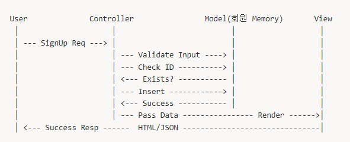
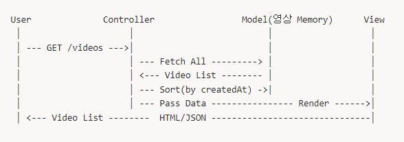
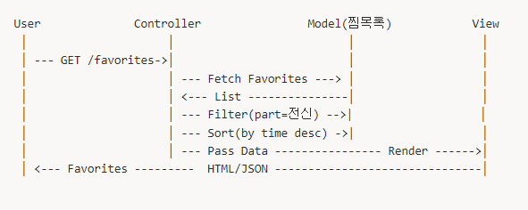
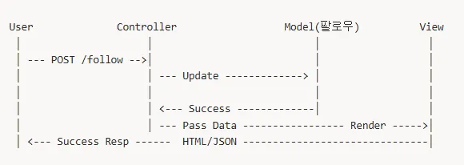
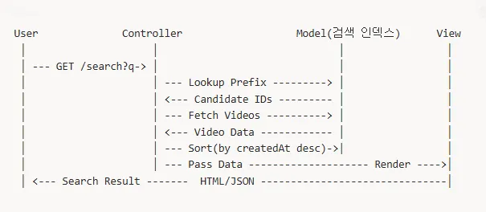

# [PJT3-J] SSAFIT

<!--  -->


## 개요

> SSAFit 운동 영상 리뷰 플랫폼
> 

**참여자   |**   안태리, 변지영

**작업일   |**   2025-09-19 (6hour)

---

# 회원/영상/찜목록/팔로우 관리 알고리즘 기획 및 설계 보고서

## 개요

이 문서는 **메모리 기반(DB미사용)**으로 회원과 영상을 관리하는 시스템의 알고리즘 및 자료구조 설계 방안을 정의한다.

핵심 기능

- 회원 관리 (CRUD, 찜목록, 팔로우)
- 영상 관리 (CRUD, 필터링, 검색)
- 찜목록 관리 (최신순, 부위별 보기)
- 팔로우 기반 확장 가능

---

## 1. 회원 관리

### 요구사항

- 회원 CRUD
- 찜목록 관리
- 팔로우 관계 관리

### 알고리즘 선택

- 회원: **HashMap<MemberID, Member>**
- 팔로우: **인접 리스트 Graph**
- 찜목록: **List<Favorite> + Set<VideoID>** (중복 방지)

### 알고리즘 선택 이유

**이유**:

- 회원 조회/중복검사/삭제 같은 핵심 동작은 “ID 기준”으로 일어난다.
- HashMap은 평균 **O(1)** 조회/삽입/삭제가 가능하다.
- List로 하면 **O(n)**이라 비효율적.
- HashMap은 정렬이 안되지만, 현재 기능 범위(로그인, 찜, 팔로우)에서는 정렬 요구가 없으므로 HashMap만으로 충분하다.

**트레이드오프**: 

HashMap은 내부적으로 정렬된 순서를 보장하지 않으므로,

정렬된 목록이 필요할 땐 따로 sort해야 한다.

하지만, 회원 정렬이 필요한 기능이 현재없고 추후 추가도 없어보인다.

### 데이터 구조

```java
class Member {
		long memberNo;        // 회원 번호
    String id;            // 아이디
    String password;      // 비밀번호
    String name;          // 이름 
    
    List<Favorite> favorites;     // 찜 목록
    Set<String> favoriteCheck;    // 중복 방지용
    Set<String> following;        // 내가 팔로우하는 회원
    Set<String> followers;        // 나를 팔로우하는 회원
}

```

---

## 2. 영상 관리

### 요구사항

- 영상 CRUD
- 부위별(part) 필터링
- 최신순 정렬
- 제목 검색
- 채널명 검색

### 알고리즘 선택

- 저장: **HashMap<VideoID, Video> + 정렬**
- 최신순 정렬: **List 정렬 (by createdAt DESC)**
- 검색(제목/채널): **선형 탐색 + contains()** (소규모에서는 충분)
- 필터링(부위별): **조건 검색**

### 알고리즘 선택 이유

**이유**:

- CRUD(등록·수정·삭제)는 영상 ID 기준이니 HashMap이 최적이라고 생각함.
- 최신순 정렬은 전체 리스트를 가져와 **O(n log n)** 정렬 → 영상 수천~수만까지는 충분히 빠르다.
- “필터링(부위별)”도 조건 검색 후 정렬로 처리 가능.

**트레이드오프**: 

정렬 상태를 항상 유지하는 Tree 구조도 있지만, 삽입이 느려지고 정렬 기준이 바뀌면 불편 → 조회 시 정렬이 더 유연.

### 데이터 구조

```java
class Video {
    String id;
    String title;
    String channelName;
    String part;           // 전신, 상체, 하체, 코어 등
    LocalDateTime createdAt;
}

```

---

## 3. 찜목록 관리

### 요구사항

- 중복 방지
- 전체 최신순 정렬
- 부위별 최신순 정렬

### 알고리즘 선택

- 저장: **List<Favorite>** (append)
- 중복 방지: **Set<VideoID>**
- 조회: **Filter + Sort(by time desc)**

### 알고리즘 선택 이유

**이유**:

- 찜은 “추가 순서”와 “최신순”이 중요 → List에 Timestamp 기록.
- 같은 영상을 여러 번 찜하면 안 되므로 Set으로 중복 방지.
- 조회 시 최신순 정렬/부위별 필터링을 적용 → O(n log n)이고, 유저 한명이 필요할때 호출하니 부담이 없을거라고 생각된다.

**트레이드오프**: 

실시간으로 항상 최신순 정렬된 상태를 유지하려면 Tree/Heap 필요하지만, 찜목록 규모가 작아 조회 시 정렬로 충분.

### 데이터 구조

```java
class Favorite {
    String videoId;
    String part;
    LocalDateTime time; // 찜한 시간
}

```

---

## 4. 팔로우 기능

### 요구사항

- 팔로우/언팔로우
- 팔로잉/팔로워 목록 조회

### 알고리즘 선택

- **Map<MemberID, Set<MemberID>>** (인접 리스트 방식)
- 삽입/삭제/조회 모두 O(1)

### 알고리즘 선택 이유

**이유**:

- 팔로우/언팔로우는 “노드 간 관계” → Graph 모델로 사용하면 타고 가기도 편하고 추후 union으로 관리해서 확장하기에도 좋아보임.
- 특정 회원이 팔로우하는 목록 조회 = Set 조회 → O(1).
- 팔로워·팔로잉 관계 탐색, 추천(“팔로우의 팔로우”) 같은 확장 기능 가능.

**트레이드오프**: 

인접 행렬보다 메모리 절약, 대규모 소셜 관계에도 적합.

---

## 5. 검색 알고리즘 (단어 단위 Trie + 접두사 검색)

### 요구사항

- 제목/채널명 검색 지원
- 부분 문자열 전체는 제외, **단어 단위 + 접두사 검색** 지원
- 최신순 정렬 및 페이징

### 알고리즘 선택

- **Trie (Prefix Tree)**: 단어 단위로 인덱싱, 접두사 탐색을 O(m)에 수행

### 알고리즘 선택 이유

1. **선형 탐색 방식 (contains 기반)**
    - 모든 영상을 순회하며 검색어 포함 여부 확인
    - 시간복잡도: O(n * m) (n=영상 수, m=문자열 길이)
    - 데이터 수가 많아질수록 급격히 느려짐 → 비효율적
2. **HashMap 역색인 (정확 매칭만 지원)**
    - 토큰 단위로 `Map<String, Set<VideoID>>` 구성
    - “정확히 같은 단어” 검색은 O(1)로 빠름
    - 하지만 `"다이"` 같은 접두사·부분 검색은 불가
3. **Trie (선택된 방법)**
    - 제목/채널명을 단어 단위로 쪼개어 Trie에 저장
    - 접두사 탐색: **O(m)** (m=검색어 길이)
    - `"다이"` 입력 시 `"다이어트"` 단어까지 자동 탐색 가능
    - 후보군만 최신순 정렬: **O(n' log n')** (n' = 후보 수, n' ≪ n)
    - **빠르고 직관적이며, 확장 시 자동완성/추천에도 활용 가능**

**트레이드오프**

- Trie는 HashMap보다 메모리 사용량이 크다.
- 하지만 검색 성능(접두사 탐색 O(m))이 중요하므로 채택했다.
- 부분 문자열 전체(`contains`)는 지원하지 않지만,
    
    → **“단어 단위 + 접두사 검색”으로 충분히 사용자 기대치를 충족**.
    

### Trie 구조

```java
class TrieNode {
    Map<Character, TrieNode> children = new HashMap<>();
    Set<String> videoIds = new HashSet<>();
}

class Trie {
    TrieNode root = new TrieNode();

    void insert(String word, String videoId) { ... }
    Set<String> searchPrefix(String prefix) { ... }
}

```

### 인덱스 구축

- 영상 제목/채널명 → 단어 단위로 분리 → Trie에 삽입
- 예: `"하루 15분 전신 다이어트 운동"`
    - `"하루"`, `"15분"`, `"전신"`, `"다이어트"`, `"운동"` 삽입

### 검색 흐름

1. 유저 검색어 `"다이"`
2. Trie에서 접두사 `"다이*"` 탐색 → `"다이어트"` 매칭
3. 매칭 단어에 연결된 VideoID 후보군 반환
4. 후보군 영상을 최신순 정렬 후 페이징

### 시간복잡도

- 삽입: O(k) (k=단어 길이)
- 검색: O(m) (m=검색어 길이)
- 후처리: 후보군 수 n'만 정렬 O(n' log n')

---

## 시간복잡도

| 기능 | 자료구조 | 시간복잡도 |
| --- | --- | --- |
| 회원 조회 | HashMap | O(1) |
| 영상 CRUD | HashMap | O(1) |
| 영상 최신순 정렬 | List + Sort | O(n log n) |
| 영상 부위별 필터링 | Filter + Sort | O(n log n) |
| 제목/채널 접두사 검색 | Trie + 정렬 | O(m + n' log n') |
| 찜 추가 | List + Set | O(1) |
| 찜 최신순 조회 | List + Sort | O(n log n) |
| 팔로우 추가/삭제 | Set | O(1) |

---

## 결론

- **회원**: HashMap 기반 CRUD
- **영상**: HashMap + Trie 기반 검색
- **찜목록**: List(Timestamp) + Set(중복 방지), 조회 시 정렬
- **팔로우**: 인접 리스트 Graph << 잘 생각해볼것 (일방적인 맞팔로우 및 너무나 커지는 연결수)
- **검색**: 단어 단위 Trie로 접두사 검색 지원 → 빠르고 직관적

단순하지만, 추후 확장이 가능한 것을 고려하려고 노력했음.

---

## 1. 회원 관리 (회원가입)



- **알고리즘 포인트**: 회원은 `HashMap<MemberID, Member>`로 관리 → 조회/삽입 O(1).

---

## 2. 영상 관리 (영상 목록 최신순 조회)



- **알고리즘 포인트**: 영상은 `HashMap<VideoID, Video>`에 저장, 조회 후 정렬.

---

## 3. 찜목록 관리 (찜 최신순 + 부위별)



- **알고리즘 포인트**: 찜목록은 `List`에 저장, `Set`으로 중복 방지, 조회 시 정렬.

---

## 4. 팔로우 기능 (팔로우 추가)



- **알고리즘 포인트**: 팔로우 관계 = `Map<MemberID, Set<MemberID>>` (인접 리스트), 삽입/삭제 O(1).

---

## 5. 검색 기능 (단어 단위 Trie + 접두사 검색)



---

# AI 활용 방안

팔로우 **인접 그래프**와 **찜목록**만으로, “내가 아직 찜하지 않은 상위 N개”를 추출한 뒤,

이 후보 중에서 사용자에게 가장 적합한 영상을 **AI API로 소량 재선별** 하는 알고리즘

**후보 추출과 점수화는 기존 알고리즘으로 처리하고**,

**AI는 상위 K 후보(예: 10 ~ 20개)**만 받아 사용자에게 적합한(사용자 시청기록이나… 찜목록이나… 성별 등등 사용자 데이터를 ai 쿼리에 함께 넣어서) 최종 N개를 고르도록 해 **토큰 사용을 줄이는** 것이 목표!

# 팔로워 기반 영상 간단 추천 알고리즘

## 입력 / 자료구조

- **팔로우 그래프**: `follow: Map<MemberID, Set<MemberID>>`
    - `follow[u]` = 내가 팔로우하는 이웃들(깊이 1)
- **찜목록**: `favorites: Map<MemberID, Set<VideoID>>`

## 알고리즘

### 깊이 1만 보기

1. **내가 팔로우하는 이웃들** 가져오기: `N1 = follow[user]`
2. **이웃들의 찜 합치기**: `pool = ⋃ favorites[v] for v in N1`
3. **내가 이미 찜한 것 제외**: `pool -= favorites[user]`
4. **빈도 점수**: `score[vid] = (# of followers who faved vid)`
5. **정렬**: `score DESC`
6. **상위 N** 반환

> depts1까지 보고 영상 개수가 부족하면, 깊이 2까지 확장: N2 = 팔로우의 팔로우(가중치 0.5로 낮게 반영)
> 

## 의사코드

```
function recommend(user, N):
  my = favorites[user]
  neighbors = follow[user]
  count = Map<VideoID, int>()

  // 팔로워 찜 목록 기반 빈도 집계
  for n in neighbors:
    for vid in favorites[n]:
      if vid not in my:
        count[vid] += 1

  // 기본 정렬 (빈도 우선, 필요 시 최근성/부위 보너스 추가)
  list = sort by (count[vid] DESC)

  // 상위 K개만 AI에 전달하여 최종 N개 선택
  candidates = list.take(K)
  videos = ai_request(user, candidates, N)

function ai_request(user, candidates, N):
  // 유저 정보(선호 부위, 최근 찜)와 후보 영상 리스트를 AI API에 전달
  // “이 중에서 사용자에게 맞는 N개를 골라라” 요청
  // JSON 결과 {recommendations: [...]}를 파싱 후 반환
  return recommendations
```

## 선택 이유

- **데이터를 필요한 만큼만 봄**(내 이웃의 찜만): 토큰 비용↓
- **학습/LLM 불필요**: 해석 쉬움, 디버그 쉬움
- **확장이 쉬움**: 깊이 2, 보너스 규칙, 가중치만 얹으면 됨